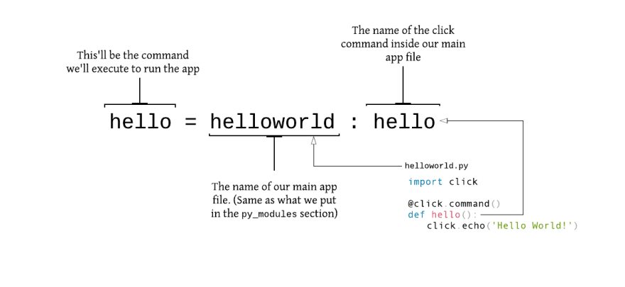

# cli_app_python_01
Building CLI Apps with Python

# Comandos:
    - Instalar el paquete creado: 
    ´´´
    $ (venv) $ pip install --editable .

    ´´´

    - luego probar:
    ´´´
    (venv) $ hello
    output: Hello World!
    ´´´
    
    - $ hello --help
    -try another commands:
      (venv) $ hello
        out: Hello World! Also, hey you ☺️
      (venv) $ hello wilson
        out: Hello World! Also, hey wilson ☺️
      (venv) $ hello wilson -c upper
        out: HELLO WORLD! ALSO, HEY WILSON ☺️

# Referencias
 - https://dev.to/wangonya/using-setuptools-to-package-your-python-app-18p4
 - python module names shouldn't have dashes
 - Example for **setup.py** configuration:
   